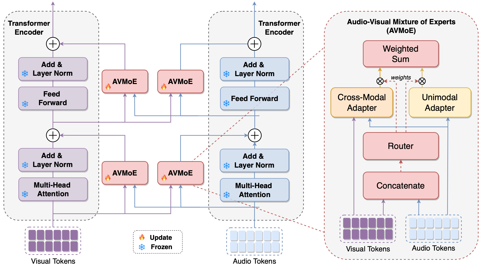
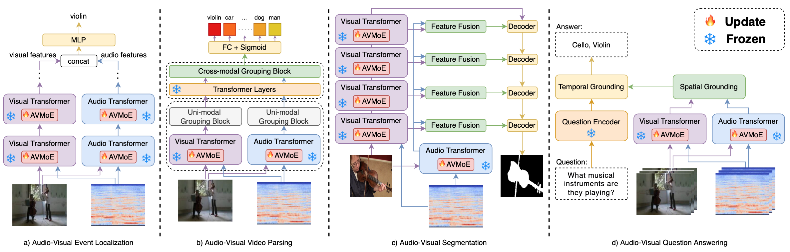

# Mixture of Experts for Audio-Visual Learning
This repository is the official implementation of our paper "Mixture of Experts for Audio-Visual Learning", accepted by NeurIPS 2024.



Method Overview.

In this paper, we explore parameter-efficient transfer learning for audio-visual learning and propose the Audio-Visual Mixture of Experts (AVMOE) to inject adapters into pre-trained models flexibly. Specifically, we introduce unimodal and cross-modal adapters as multiple experts to specialize in intra-modal and inter-modal information, respectively, and employ a lightweight router to dynamically allocate the weights of each expert according to the specific demands of each task. 

For more details, please check the latest version of the paper: [Mixture of Experts for Audio-Visual Learning](https://openreview.net/pdf?id=SNmuKbU0am)


Applying AVMoE to audio-visual downstream tasks: audio-visual event localization, audio-visual video parsing, audio-visual segmentation, and audio-visual question answering

------

### 📝Requirements and Installation

- ###### Getting Started

    ```python
    cd AVMOE
    pip install -r requirements.txt
    ```

- ###### Download HTS-AT Backbone

    Download `checkpoints.zip` from [Baidu Disk](https://pan.baidu.com/s/1oe8beqNiH9bA4geRlHTC7g?pwd=2025) (pwd: 2025), and extract it into the directory `./AVMOE/.`

## AVE
- ###### Download Data

  Download `frames.zip` [Baidu Disk](https://pan.baidu.com/s/1no7R-AJK0A8aQfiFRnAmJQ?pwd=2025) (pwd: 2025), `wave.zip` from [Baidu Disk](https://pan.baidu.com/s/15fKrgbyQmjhZtXY6-d2T0w?pwd=2025) (pwd: 2025), and extract them into the directory `./data/AVE`/.

- ###### Usage

  Go to AVE task directory.

  ```
  cd AVMOE/AVE
  ```

  - Train

    ```c
    bash train.sh
    ```
  - Test

    ```c
    bash test.sh
    ```

## AVQA
## AVVP

## AVS


## 👍Acknowledgments

Our code is based on [DG-SCT](https://github.com/haoyi-duan/DG-SCT), [CMBS](https://github.com/marmot-xy/CMBS), [AVSBench](https://github.com/OpenNLPLab/AV[SBench), [MGN](https://github.com/stoneMo/MGN), [MUSIC-AVQA](https://github.com/GeWu-Lab/MUSIC-AVQA), and [LAVisH](https://github.com/GenjiB/LAVISH).

